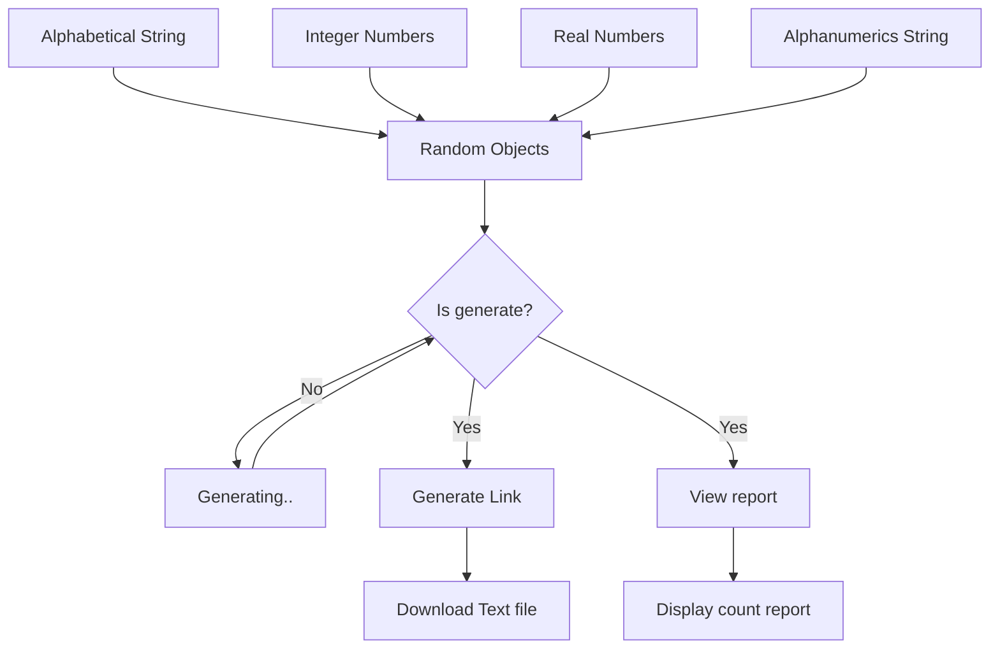

# Random objects generator
A web application for generating random objects with Python Django framework

# Application diagram


# Prerequisite

- [x] Need to have installed Python's latest version - 3.9.7

# Installations

- Clone this repository in your preferable directory
- Active virtual environment
```
python -m venv env
env\Scripts\activate
```
- Install ` requirements.txt ` file

```
pip install -r requirements.txt
```
# Run Server

```
python manage.py runserver
```

# Test Application

- Click the `Generate ` button to generate four types of random objects
- After appearing the `Download random objects file...` click it to download a text file consisting of these four types of random objects within ~2MB
- Click the `View Report` button to show the stats of random objects. There will be a count stats of these each object 
